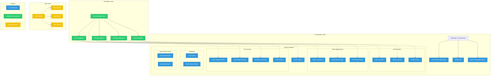

```mermaid
graph TB
    subgraph "Presentation Layer"
        UI_Components["Reusable UI Components"]
        click UI_Components "https://github.com/sadiquereyaz/best-book/tree/main/app/src/main/java/com/nabssam/bestbook/ui/components/"
        
        AutoScroll["Auto Scroll Image Pager"]:::ui
        click AutoScroll "https://github.com/sadiquereyaz/best-book/blob/main/app/src/main/java/com/nabssam/bestbook/ui/components/AutoScrollImagePager.kt"
        
        RatingBar["Rating Bar"]:::ui
        click RatingBar "https://github.com/sadiquereyaz/best-book/blob/main/app/src/main/java/com/nabssam/bestbook/ui/components/RatingBar.kt"
        
        BottomNav["Bottom Navigation Menu"]:::ui
        click BottomNav "https://github.com/sadiquereyaz/best-book/blob/main/app/src/main/java/com/nabssam/bestbook/ui/components/BottomNavigationMenu.kt"
        
        UI_Components --> AutoScroll
        UI_Components --> RatingBar
        UI_Components --> BottomNav
        
        subgraph "Feature Modules"
            Home["Home Screen"]:::ui
            click Home "https://github.com/sadiquereyaz/best-book/blob/main/app/src/main/java/com/nabssam/bestbook/ui/feature/home/HomeScreen.kt"
            
            subgraph "Authentication"
                SignIn["Sign In Screen"]:::ui
                click SignIn "https://github.com/sadiquereyaz/best-book/blob/main/app/src/main/java/com/nabssam/bestbook/ui/feature/account/auth/SignInScreen.kt"
                SignUp["Sign Up Screen"]:::ui
                click SignUp "https://github.com/sadiquereyaz/best-book/blob/main/app/src/main/java/com/nabssam/bestbook/ui/feature/account/auth/SignupScreen.kt"
                Profile["Profile Screen"]:::ui
                click Profile "https://github.com/sadiquereyaz/best-book/blob/main/app/src/main/java/com/nabssam/bestbook/ui/feature/account/profile/ProfileScreen.kt"
            end
            
            subgraph "Book Management"
                BookList["Book List Screen"]:::ui
                click BookList "https://github.com/sadiquereyaz/best-book/blob/main/app/src/main/java/com/nabssam/bestbook/ui/feature/bookList/BookListScreen.kt"
                BookDetail["Book Detail Screen"]:::ui
                click BookDetail "https://github.com/sadiquereyaz/best-book/blob/main/app/src/main/java/com/nabssam/bestbook/ui/feature/bookDetail/BookDetailScreen.kt"
                PdfView["PDF View Screen"]:::ui
                click PdfView "https://github.com/sadiquereyaz/best-book/blob/main/app/src/main/java/com/nabssam/bestbook/ui/feature/bookList/pdfViewScreen.kt"
            end
            
            subgraph "Quiz System"
                QuizCategory["Quiz Category Screen"]:::ui
                click QuizCategory "https://github.com/sadiquereyaz/best-book/blob/main/app/src/main/java/com/nabssam/bestbook/ui/feature/quiz/QuizCategoryScreen.kt"
                QuizSubject["Quiz Subject Screen"]:::ui
                click QuizSubject "https://github.com/sadiquereyaz/best-book/blob/main/app/src/main/java/com/nabssam/bestbook/ui/feature/quiz/QuizSubjectScreen.kt"
                QuizList["All Quiz List Screen"]:::ui
                click QuizList "https://github.com/sadiquereyaz/best-book/blob/main/app/src/main/java/com/nabssam/bestbook/ui/feature/quiz/AllQuizListScreen.kt"
                MCQ["MCQ Screen"]:::ui
                click MCQ "https://github.com/sadiquereyaz/best-book/blob/main/app/src/main/java/com/nabssam/bestbook/ui/feature/quiz/MCQScreen.kt"
            end
            
            subgraph "Shopping"
                Cart["Cart Screen"]:::ui
                click Cart "https://github.com/sadiquereyaz/best-book/blob/main/app/src/main/java/com/nabssam/bestbook/ui/feature/cart/CartScreen.kt"
                OrderStatus["Order Status Screen"]:::ui
                click OrderStatus "https://github.com/sadiquereyaz/best-book/blob/main/app/src/main/java/com/nabssam/bestbook/ui/feature/orderConfirmScreen/OrderStatusScreen.kt"
            end
            
            subgraph "Subscribed Content"
                SubBooks["Subscribed Books"]:::ui
                click SubBooks "https://github.com/sadiquereyaz/best-book/blob/main/app/src/main/java/com/nabssam/bestbook/ui/feature/subscribedEbook/SubscribedBookScreen.kt"
                SubQuiz["Subscribed Quiz"]:::ui
                click SubQuiz "https://github.com/sadiquereyaz/best-book/blob/main/app/src/main/java/com/nabssam/bestbook/ui/feature/subscribedQuiz/SubscribedBookScreen.kt"
            end
        end
    end
    
    subgraph "Navigation Layer"
        AppNav["App Navigation Host"]:::nav
        click AppNav "https://github.com/sadiquereyaz/best-book/blob/main/app/src/main/java/com/nabssam/bestbook/ui/navigation/AppNavHost.kt"
        
        AuthGraph["Auth Navigation"]:::nav
        click AuthGraph "https://github.com/sadiquereyaz/best-book/blob/main/app/src/main/java/com/nabssam/bestbook/ui/navigation/auth/AuthGraph.kt"
        
        BookGraph["Book Navigation"]:::nav
        click BookGraph "https://github.com/sadiquereyaz/best-book/blob/main/app/src/main/java/com/nabssam/bestbook/ui/navigation/main/BookGraph.kt"
        
        QuizGraph["Quiz Navigation"]:::nav
        click QuizGraph "https://github.com/sadiquereyaz/best-book/blob/main/app/src/main/java/com/nabssam/bestbook/ui/navigation/main/QuizGraph.kt"
        
        SettingsGraph["Settings Navigation"]:::nav
        click SettingsGraph "https://github.com/sadiquereyaz/best-book/blob/main/app/src/main/java/com/nabssam/bestbook/ui/navigation/main/SettingsGraph.kt"
        
        AppNav --> AuthGraph
        AppNav --> BookGraph
        AppNav --> QuizGraph
        AppNav --> SettingsGraph
    end
    
    subgraph "Data Layer"
        Models["Data Models"]:::data
        click Models "https://github.com/sadiquereyaz/best-book/tree/main/app/src/main/java/com/nabssam/bestbook/data/model/"
        
        Book["Book Model"]:::data
        click Book "https://github.com/sadiquereyaz/best-book/blob/main/app/src/main/java/com/nabssam/bestbook/data/model/BookModel.kt"
        
        QuizModel["Quiz Model"]:::data
        click QuizModel "https://github.com/sadiquereyaz/best-book/blob/main/app/src/main/java/com/nabssam/bestbook/data/model/Quiz.kt"
        
        UserModel["User Model"]:::data
        click UserModel "https://github.com/sadiquereyaz/best-book/blob/main/app/src/main/java/com/nabssam/bestbook/data/model/User.kt"
        
        Models --> Book
        Models --> QuizModel
        Models --> UserModel
    end
    
    %% Relationships
    AppNav -.-> Home
    AuthGraph -.-> SignIn
    AuthGraph -.-> SignUp
    AuthGraph -.-> Profile
    BookGraph -.-> BookList
    BookGraph -.-> BookDetail
    BookGraph -.-> PdfView
    QuizGraph -.-> QuizCategory
    QuizGraph -.-> QuizSubject
    QuizGraph -.-> QuizList
    QuizGraph -.-> MCQ
    
    %% Styles
    classDef ui fill:#3498db,stroke:#2980b9,color:#fff
    classDef nav fill:#2ecc71,stroke:#27ae60,color:#fff
    classDef data fill:#f1c40f,stroke:#f39c12,color:#fff
    
    %% Legend
    subgraph Legend
        UI["UI Component"]:::ui
        NAV["Navigation Component"]:::nav
        DATA["Data Component"]:::data
    end
```
