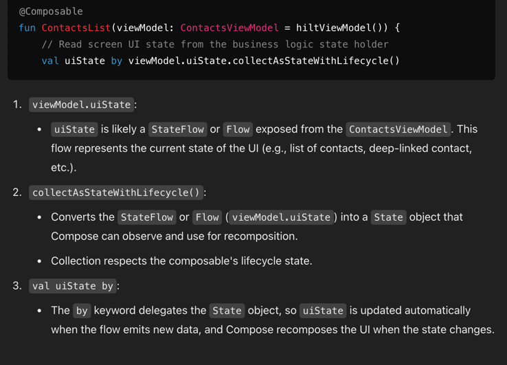

package com.nabssam.bestbook.common.util

# collectAsStateWithLifecycle
is an extension function provided by Android's Jetpack Compose. 
It allows a _StateFlow_ or Flow to be collected in a Jetpack Compose UI while respecting the lifecycle of the UI component (like a Composable function). 
>This ensures that the flow is only collected when the UI is in an appropriate lifecycle state (e.g., STARTED or RESUMED) and is paused otherwise, 
preventing unnecessary computations and avoiding memory leaks.

**It ensures no unnecessary recompositions or collection of data when the UI is not visible.**

```kotlin
@Composable
fun ContactsList(viewModel: ContactsViewModel = hiltViewModel()) {
    // Read screen UI state from the business logic state holder
    val uiState by viewModel.uiState.collectAsStateWithLifecycle()

}

class ContactsViewModel : ViewModel() {
    private val _uiState = MutableStateFlow(ContactsUiState(emptyList(), null))
    val uiState: StateFlow<ContactsUiState> = _uiState.asStateFlow()
}

```


# accessing argument in viewmodel
```kotlin
class UserViewModel(
    savedStateHandle: SavedStateHandle,
    private val userInfoRepository: UserInfoRepository
) : ViewModel() {

    private val profile = savedStateHandle.toRoute<Profile>()

    // Fetch the relevant user information from the data layer,
    // ie. userInfoRepository, based on the passed userId argument
    private val userInfo: Flow<UserInfo> = userInfoRepository.getUserInfo(profile.id)

// …

}
```

# If you need to retrieve the instance of a ViewModel scoped to navigation routes or the navigation graph instead, use the hiltViewModel composable function and pass the corresponding backStackEntry as a parameter:


```kotlin
 import androidx.hilt.navigation.compose.hiltViewModel
 import androidx.navigation.compose.getBackStackEntry

@Composable
fun MyApp() {
    val navController = rememberNavController()
    val startRoute = "example"
    val innerStartRoute = "exampleWithRoute"
    NavHost(navController, startDestination = startRoute) {
        navigation(startDestination = innerStartRoute, route = "Parent") {
// ...
            composable("exampleWithRoute") { backStackEntry ->
                val parentEntry = remember(backStackEntry) {
                    navController.getBackStackEntry("Parent")
                }
                val parentViewModel = hiltViewModel<ParentViewModel>(parentEntry)
                ExampleWithRouteScreen(parentViewModel)
            }
        }
    }
}
```

app/
├── build.gradle
└── src/
└── main/
├── java/com/example/ecommerce/
│   ├── data/
│   │   ├── local/
│   │   │   ├── dao/
│   │   │   │   ├── CartDao.kt
│   │   │   │   ├── ProductDao.kt
│   │   │   │   ├── UserDao.kt
│   │   │   │   └── OrderDao.kt
│   │   │   ├── entity/
│   │   │   │   ├── CartEntity.kt
│   │   │   │   ├── ProductEntity.kt
│   │   │   │   ├── UserEntity.kt
│   │   │   │   └── OrderEntity.kt
│   │   │   └── AppDatabase.kt
│   │   ├── remote/
│   │   │   ├── api/
│   │   │   │   ├── ProductApi.kt
│   │   │   │   ├── AuthApi.kt
│   │   │   │   └── OrderApi.kt
│   │   │   ├── dto/
│   │   │   │   ├── ProductDto.kt
│   │   │   │   ├── UserDto.kt
│   │   │   │   └── OrderDto.kt
│   │   │   └── NetworkConstants.kt
│   │   ├── repository/
│   │   │   ├── ProductRepositoryImpl.kt
│   │   │   ├── AuthRepositoryImpl.kt
│   │   │   ├── CartRepositoryImpl.kt
│   │   │   └── OrderRepositoryImpl.kt
│   │   └── mapper/
│   │       ├── ProductMapper.kt
│   │       ├── UserMapper.kt
│   │       └── OrderMapper.kt
│   ├── domain/
│   │   ├── model/
│   │   │   ├── Product.kt
│   │   │   ├── User.kt
│   │   │   ├── Cart.kt
│   │   │   └── Order.kt
│   │   ├── repository/
│   │   │   ├── ProductRepository.kt
│   │   │   ├── AuthRepository.kt
│   │   │   ├── CartRepository.kt
│   │   │   └── OrderRepository.kt
│   │   └── usecase/
│   │       ├── product/
│   │       │   ├── GetProductsUseCase.kt
│   │       │   ├── GetProductDetailsUseCase.kt
│   │       │   └── SearchProductsUseCase.kt
│   │       ├── auth/
│   │       │   ├── LoginUseCase.kt
│   │       │   ├── SignUpUseCase.kt
│   │       │   └── LogoutUseCase.kt
│   │       ├── cart/
│   │       │   ├── AddToCartUseCase.kt
│   │       │   ├── RemoveFromCartUseCase.kt
│   │       │   └── GetCartItemsUseCase.kt
│   │       └── order/
│   │           ├── PlaceOrderUseCase.kt
│   │           └── GetOrderHistoryUseCase.kt
│   ├── presentation/
│   │   ├── navigation/
│   │   │   └── NavGraph.kt
│   │   ├── theme/
│   │   │   ├── Color.kt
│   │   │   ├── Theme.kt
│   │   │   └── Type.kt
│   │   ├── components/
│   │   │   ├── ProductCard.kt
│   │   │   ├── CartItem.kt
│   │   │   ├── LoadingIndicator.kt
│   │   │   └── ErrorView.kt
│   │   ├── home/
│   │   │   ├── HomeScreen.kt
│   │   │   └── HomeViewModel.kt
│   │   ├── product/
│   │   │   ├── list/
│   │   │   │   ├── ProductListScreen.kt
│   │   │   │   └── ProductListViewModel.kt
│   │   │   └── detail/
│   │   │       ├── ProductDetailScreen.kt
│   │   │       └── ProductDetailViewModel.kt
│   │   ├── cart/
│   │   │   ├── CartScreen.kt
│   │   │   └── CartViewModel.kt
│   │   ├── auth/
│   │   │   ├── login/
│   │   │   │   ├── LoginScreen.kt
│   │   │   │   └── LoginViewModel.kt
│   │   │   └── signup/
│   │   │       ├── SignUpScreen.kt
│   │   │       └── SignUpViewModel.kt
│   │   └── order/
│   │       ├── OrderScreen.kt
│   │       └── OrderViewModel.kt
│   ├── di/
│   │   ├── NetworkModule.kt
│   │   ├── DatabaseModule.kt
│   │   ├── RepositoryModule.kt
│   │   └── UseCaseModule.kt
│   └── utils/
│       ├── Constants.kt
│       ├── Resource.kt
│       └── Extensions.kt
└── res/
└── ...